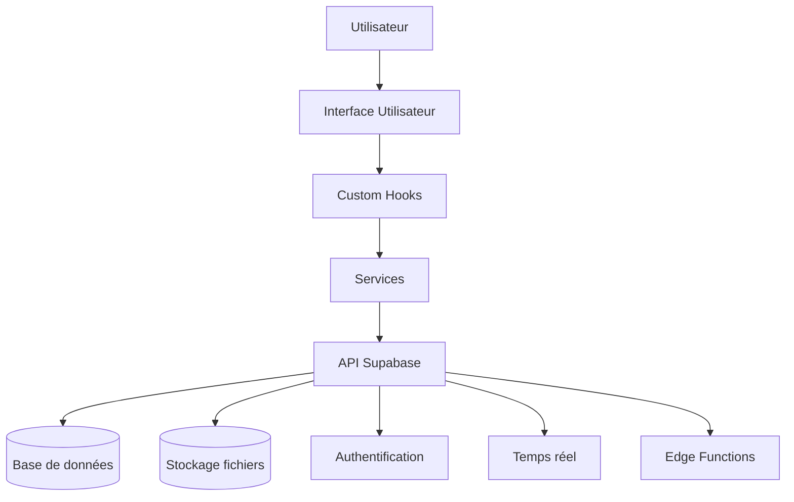

# Nordagri – ERP de gestion agricole


## 📋 Présentation générale

Nordagri est une solution ERP complète conçue pour répondre aux besoins spécifiques des exploitations agricoles. Cette application web moderne offre une interface intuitive pour gérer l'ensemble des ressources matérielles et opérationnelles d'une exploitation.

Notre plateforme permet de centraliser la gestion des équipements, la planification de la maintenance, le suivi du temps de travail, et l'inventaire des pièces détachées. Grâce à une architecture évolutive et des fonctionnalités en temps réel, Nordagri accompagne les professionnels agricoles dans l'optimisation de leurs opérations quotidiennes.

## ✨ Fonctionnalités principales

### 🚜 Gestion des équipements
- Inventaire complet de la flotte matérielle
- Suivi détaillé des caractéristiques techniques
- Gestion des compteurs d'usure (heures, kilomètres)
- Codes QR pour identification rapide
- Historique des interventions et maintenance

### 🔧 Maintenance préventive et corrective
- Planification des tâches de maintenance
- Alertes et rappels automatiques
- Suivi des interventions par priorité
- Historique complet des opérations
- Rapports et statistiques de fiabilité

### ⏱️ Suivi du temps de travail
- Enregistrement des sessions de travail
- Association aux équipements et interventions
- Rapports d'activité par période
- Analyse de la répartition du temps
- Export des données pour la facturation

### 📦 Gestion des pièces détachées
- Inventaire complet et catégorisé
- Alertes de stock bas
- Association avec les équipements compatibles
- Historique des retraits et utilisations
- Aide à la commande et réapprovisionnement

### 🛠️ Interventions et suivi de terrain
- Planification des interventions
- Suivi en temps réel
- Attribution aux techniciens
- Documentation des observations
- Rapports d'intervention

### 📊 Tableau de bord et analyses
- Vue d'ensemble des indicateurs clés
- Alertes et notifications importantes
- Calendrier des événements à venir
- Statistiques d'utilisation et de coûts

## 🚀 Démarrage rapide

### Prérequis
- Node.js (v18+)
- npm ou yarn
- Compte Supabase

### Installation

1. **Cloner le dépôt**
   ```bash
   git clone <URL_DU_REPO>
   cd nordagri
   ```

2. **Installer les dépendances**
   ```bash
   npm install
   # ou
   yarn install
   ```

3. **Configuration Supabase**
   - Créer un projet sur [Supabase](https://supabase.com)
   - Importer le schéma de base de données (voir `/supabase/schema.sql`)
   - Configurer les politiques RLS (Row Level Security) pour sécuriser les données

4. **Variables d'environnement**
   - Créer un fichier `.env.local` basé sur `.env.example`
   ```
   VITE_SUPABASE_URL=https://votre-projet.supabase.co
   VITE_SUPABASE_ANON_KEY=votre-clé-anon
   ```

5. **Lancer l'application en développement**
   ```bash
   npm run dev
   # ou
   yarn dev
   ```

6. **Build pour la production**
   ```bash
   npm run build
   # ou
   yarn build
   ```

## 📁 Structure du projet

```
nordagri/
├── docs/                    # Documentation détaillée
│   ├── architecture.md      # Architecture globale
│   ├── database.md          # Structure de la base de données
│   ├── component_tree.md    # Arborescence des composants
│   └── contribution_guide.md # Guide de contribution
├── public/                  # Ressources statiques
├── src/
│   ├── components/          # Composants React
│   │   ├── ui/              # Composants UI génériques
│   │   ├── equipment/       # Composants de gestion d'équipement
│   │   ├── parts/           # Composants de gestion des pièces
│   │   ├── maintenance/     # Composants de maintenance
│   │   └── ...
│   ├── hooks/               # Custom React hooks
│   │   ├── equipment/       # Hooks pour équipements
│   │   ├── parts/           # Hooks pour pièces détachées
│   │   └── ...
│   ├── integrations/        # Intégrations externes
│   │   └── supabase/        # Client et types Supabase
│   ├── pages/               # Composants de pages
│   ├── services/            # Services d'API et métier
│   ├── types/               # Types TypeScript
│   └── utils/               # Utilitaires
└── supabase/                # Configuration Supabase
```

### Architecture des hooks

Les hooks sont organisés par domaine fonctionnel. Chaque domaine possède sa propre structure de hooks spécialisés qui sont ensuite composés dans un hook principal pour ce domaine.

#### Exemple : Gestion des pièces

```
hooks/parts/
├── usePartsData.ts          # Récupération des données
├── usePartsFilter.ts        # Filtrage et recherche
├── useOrderParts.ts         # Commande de pièces
├── usePartsDialogs.ts       # Gestion des dialogues UI
├── usePartsCategories.ts    # Catégorisation
├── usePartsActions.ts       # Actions sur les pièces
└── usePartsWithdrawal/      # Retraits de pièces
    ├── types.ts             # Types pour les retraits
    ├── constants.ts         # Constantes
    ├── useWithdrawalDialog.ts # UI de retrait
    └── useWithdrawalHistory.ts # Historique des retraits
```

### Gestion de l'état

L'application utilise plusieurs mécanismes pour la gestion de l'état :

- **React Query** : Pour les données distantes et la mise en cache
- **Context API** : Pour l'état partagé entre composants (auth, thème)
- **Custom Hooks** : Pour l'encapsulation de la logique métier
- **Supabase Realtime** : Pour les mises à jour en temps réel

## 🔌 Intégrations

### Supabase

L'application s'appuie fortement sur Supabase pour :

- **Authentification** : Gestion des utilisateurs et des sessions
- **Base de données** : PostgreSQL pour le stockage des données
- **Stockage de fichiers** : Pour les images et documents
- **Temps réel** : Mises à jour instantanées via WebSockets
- **Edge Functions** : Traitements côté serveur sécurisés

### Génération de QR Codes

Les équipements sont identifiables via des codes QR générés avec la bibliothèque `qrcode.react`. Ces codes peuvent être scannés pour accéder rapidement aux détails d'un équipement.

### Intégration PDF

Génération de rapports PDF pour les interventions et la maintenance via `@react-pdf/renderer`.

### Exportation Excel

Export des données en format Excel pour analyse externe via la bibliothèque `xlsx`.

## 📐 Conventions de code

### TypeScript

- Utilisation stricte du typage TypeScript
- Interfaces et types définis pour tous les modèles de données
- Génériques pour les hooks réutilisables

```typescript
// Exemple de définition de type
export interface Equipment {
  id: number;
  name: string;
  model: string;
  manufacturer: string;
  year: number;
  status: 'operational' | 'maintenance' | 'repair' | 'inactive';
  // ...
}
```

### Composants React

- Hooks personnalisés pour extraire la logique métier
- Composants fonctionnels avec React.FC
- Destructuration des props
- Patterns de composition

```tsx
// Exemple de composant
const EquipmentCard: React.FC<EquipmentCardProps> = ({ 
  equipment, 
  onView,
  onEdit 
}) => {
  // ...
};
```

### Nommage

- **Composants** : PascalCase (ex: `EquipmentList.tsx`)
- **Hooks** : camelCase avec préfixe "use" (ex: `useEquipmentData.ts`)
- **Services** : camelCase (ex: `equipmentService.ts`)
- **Dossiers** : kebab-case (ex: `time-tracking`)
- **Constantes** : SCREAMING_SNAKE_CASE (ex: `MAX_UPLOAD_SIZE`)

### Documentation et commentaires

- JSDoc pour les fonctions et composants principaux
- Commentaires explicatifs pour la logique complexe
- Types bien documentés

```typescript
/**
 * Hook pour gérer les retraits de pièces du stock
 * @returns Méthodes et données pour gérer les retraits
 */
export const usePartsWithdrawal = () => {
  // ...
};
```

## 🔍 Tests et bonnes pratiques

### Tests

- Tests unitaires avec Vitest pour les fonctions utilitaires
- Tests de composants avec React Testing Library
- Tests d'intégration pour les flux principaux

### Bonnes pratiques

- **DRY** (Don't Repeat Yourself) : Mutualisation du code commun
- **SOLID** : Principes appliqués à la structure des hooks et services
- **Accessibilité** : Composants UI conformes aux standards WCAG
- **Performance** : Optimisation des rendus avec useMemo et useCallback
- **Sécurité** : Validation des entrées, protection RLS côté Supabase

## 📊 Architecture globale



### Flux de données

1. L'utilisateur interagit avec l'interface
2. Les composants UI déclenchent des actions
3. Les hooks personnalisés orchestrent la logique
4. Les services communiquent avec Supabase
5. Supabase effectue les opérations sur la base de données
6. Les changements sont propagés en temps réel aux clients connectés

## 📄 Licence

Ce projet est sous licence propriétaire. Tous droits réservés.

## 👥 Équipe

Développé par l'équipe Nordagri.

---

Pour plus de détails, consultez les documents dans le dossier `/docs`.
